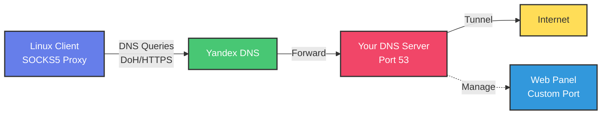

<div align="center">

# 🚀 DNS Tunnel Pro

### Professional DNS Tunneling Solution with DoH Support

[](https://opensource.org/licenses/MIT)
[](https://www.python.org/downloads/)
[]()
[](http://makeapullrequest.com)
[](https://github.com/Mr-X-01/dns-tunnel-pro)

**Обход сетевых ограничений через DNS-туннелирование с шифрованием AES-256**

[Возможности](#-возможности) •
[Быстрый старт](#-быстрый-старт) •
[Установка](#-установка) •
[Документация](#-документация) •
[Безопасность](#-безопасность)

</div>

---

## ✨ Возможности

<table>
<tr>
<td width="50%">

### 🔐 Безопасность
- **AES-256-GCM** шифрование
- **Let's Encrypt** SSL сертификаты
- **DoH** (DNS-over-HTTPS)
- Уникальные ключи на клиента
- Защита от DPI

### 🎛️ Управление
- **Веб-панель** с HTTPS
- Создание клиентов в 1 клик
- Генерация конфигов
- Real-time мониторинг
- Статистика трафика

</td>
<td width="50%">

### ⚡ Производительность
- **~1.5 Мбит/с** через DoH
- Низкая задержка (100-300ms)
- Мультипоточная обработка
- Auto-reconnect клиентов

### 🚀 Простота
- **Установка за 2 минуты**
- Автоматическая настройка firewall
- Генерация SSL сертификатов
- Docker поддержка
- Подробная документация

</td>
</tr>
</table>

## 🏗️ Архитектура



### Поток данных:

1. 📱 **Клиент** → Запрос через SOCKS5 (127.0.0.1:1080)
2. 🔐 **Шифрование** → AES-256-GCM + уникальный nonce
3. 📦 **Кодирование** → Base64 в DNS subdomain
4. 🌐 **DoH запрос** → HTTPS к Яндекс DNS
5. 🔄 **Туннелирование** → Ваш DNS сервер
6. 🌍 **Интернет** → Реальный HTTP запрос
7. ⬅️ **Ответ** → Через DNS TXT запись
8. 🔓 **Расшифровка** → Клиент получает данные

## ⚡ Быстрый старт

<details>
<summary><b>📹 Видео-инструкция (кликните)</b></summary>

> 🎬 Скоро будет добавлено видео с полной установкой и настройкой!

</details>

### 🖥️ Серверная часть (5 минут)

**Требования:**
- VPS с Ubuntu 20.04+ / Debian 11+
- Минимум 512MB RAM
- Публичный IP адрес
- Свой домен (например: `tunnel.example.com`)
- Root доступ

**Установка одной командой:**

```bash
curl -sSL https://raw.githubusercontent.com/Mr-X-01/dns-tunnel-pro/main/install.sh | sudo bash
```

**Во время установки вас спросят:**
- ✅ Ваш домен (например: `tunnel.example.com`)
- ✅ Email для Let's Encrypt
- ✅ Порт для веб-панели (по умолчанию: случайный 10000-60000)
- ✅ Пароль администратора

**Скрипт автоматически:**
- 🔧 Установит все зависимости
- 🔥 Настроит firewall (UFW)
- 🔐 Сгенерирует SSL сертификаты через Let's Encrypt
- 🚀 Запустит DNS сервер и веб-панель
- ✅ Создаст systemd сервис

**После установки:**

```bash
# Проверьте статус
systemctl status dns-tunnel

# Откройте веб-панель
https://tunnel.example.com:CUSTOM_PORT
```

---

### 💻 Клиентская часть (2 минуты)

**Установка клиента:**

```bash
curl -sSL https://raw.githubusercontent.com/Mr-X-01/dns-tunnel-pro/main/client-install.sh | bash
```

**Создание клиента в веб-панели:**

1. Войдите в веб-панель
2. Перейдите в раздел **"Клиенты"**
3. Нажмите **"+ Добавить клиента"**
4. Введите имя (например: "Мой ноутбук")
5. Нажмите **"Создать"**
6. Скачайте конфигурационный файл

**Подключение:**

```bash
# Запустите клиент
dns-tunnel-client connect config.json

# Проверьте подключение
curl --socks5 127.0.0.1:1080 https://ipinfo.io
```

**Вы должны увидеть IP адрес вашего VPS сервера!** ✅

## 🔧 Требования

### Сервер
- VPS с Ubuntu 20.04+ / Debian 11+
- Минимум 512MB RAM
- Публичный IP адрес
- Свой домен (например: `tunnel.yourdomain.com`)
- Root доступ

### Клиент
- Linux (любой дистрибутив)
- Python 3.8+
- Права sudo (для установки)

## 📖 Детальная настройка

### 1. Настройка DNS

Добавьте NS-запись для вашего домена:

```
tunnel.yourdomain.com.  IN  NS  ns.yourdomain.com.
ns.yourdomain.com.      IN  A   YOUR_SERVER_IP
```

### 2. Настройка сервера

```bash
cd dns-tunnel-pro/server
sudo python3 install_deps.py
sudo python3 server.py
```

### 3. Веб-панель

Доступна на `https://YOUR_IP:8443`

**Функции:**
- ✅ Создание/удаление клиентов
- ✅ Генерация конфигов
- ✅ Просмотр статистики
- ✅ Мониторинг подключений
- ✅ Управление пользователями

### 4. Подключение клиента

```bash
# Скачайте конфиг из веб-панели
# Запустите клиент
dns-tunnel-client connect config.json

# Проверьте подключение
curl --socks5 127.0.0.1:1080 https://ipinfo.io
```

## 🐳 Docker Compose

```bash
# Запуск через Docker
docker-compose up -d

# Просмотр логов
docker-compose logs -f

# Остановка
docker-compose down
```

## 📁 Структура проекта

```
dns-tunnel-pro/
├── server/                 # Серверная часть
│   ├── web_panel/         # Веб-панель (Flask)
│   ├── dns_server/        # DNS туннель сервер
│   ├── database/          # SQLite БД
│   └── config/            # Конфигурация
├── client/                # Клиентская часть
│   ├── dns_client.py     # DNS туннель клиент
│   └── utils/            # Утилиты
├── install.sh            # Установка сервера
├── client-install.sh     # Установка клиента
├── docker-compose.yml    # Docker конфигурация
└── README.md             # Документация
```

## 🔐 Безопасность

- 🔒 **TLS/SSL**: Веб-панель использует HTTPS
- 🔑 **Шифрование**: AES-256-GCM для туннеля
- 🎲 **Уникальные ключи**: Для каждого клиента
- 🛡️ **Защита от перебора**: Rate limiting на веб-панели
- 📝 **Логирование**: Аудит всех действий

## ⚙️ Конфигурация

### server/config/settings.yml

```yaml
dns:
  port: 53
  domain: tunnel.yourdomain.com
  doh_resolver: https://common.dot.dns.yandex.net/dns-query

web_panel:
  port: 8443
  secret_key: CHANGE_ME
  
proxy:
  socks5_port: 1080
```

## 📊 Мониторинг

Веб-панель предоставляет:
- Количество активных клиентов
- Объем переданных данных
- Графики нагрузки
- История подключений

## 🐛 Отладка

```bash
# Логи сервера
tail -f /var/log/dns-tunnel/server.log

# Логи клиента
dns-tunnel-client logs

# Тест DNS резолвинга
dig @YOUR_SERVER_IP test.tunnel.yourdomain.com
```

## 🤝 Вклад в проект

Приветствуются Pull Request'ы! 

1. Fork проекта
2. Создайте ветку (`git checkout -b feature/AmazingFeature`)
3. Commit изменения (`git commit -m 'Add some AmazingFeature'`)
4. Push в ветку (`git push origin feature/AmazingFeature`)
5. Откройте Pull Request

## 📜 Лицензия

Распространяется под лицензией MIT. См. `LICENSE` для деталей.

## ⚠️ Disclaimer

Этот инструмент создан исключительно в образовательных целях. Используйте ответственно и в соответствии с законодательством вашей страны.

## 📞 Контакты

- GitHub: [@Mr-X-01](https://github.com/Mr-X-01)
- Issues: [GitHub Issues](https://github.com/Mr-X-01/dns-tunnel-pro/issues)

## 🙏 Благодарности

- [dnslib](https://github.com/paulc/dnslib) - DNS библиотека
- [Flask](https://flask.palletsprojects.com/) - Веб-фреймворк
- Сообщество за идеи и фидбек

---

**⭐ Если проект помог - поставьте звезду!**
